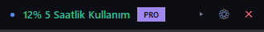
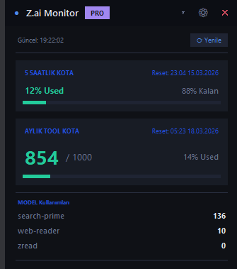

# Z.ai Monitor
![GitHub stars]
![GitHub downloads]
![GitHub release]
<p align="center">

Always-on-top desktop overlay that shows your **Z.ai API quota and token usage in real time**.

Lightweight • Draggable • Fast • Minimal

</p>

<p align="center">


</p>

<p align="center">

<a href="https://github.com/USERNAME/REPO/releases/latest">

</a>

</p>

---

# Overview

**Z.ai Monitor** is a lightweight desktop widget that displays your **Z.ai API quota usage in real time**.

It runs as a small floating overlay and stays visible while you work.

Perfect for developers using Z.ai APIs who want quick visibility into their usage without opening dashboards.

---

# Features

* Real-time quota monitoring
* Always-on-top overlay widget
* Draggable floating window
* Dark / Light theme
* Configurable refresh interval
* Lightweight resource usage
* Simple standalone API client
* Automatic bearer token handling

---

# Screenshot

<p align="center">

</p>

<p align="center">

</p>

---

# Installation

## Requirements

* Python **3.8+**
* pip

Install dependency:

```bash
pip install requests
```

---

# Run the Application

### Normal run

```bash
python app.py
```

### Windows background mode (no terminal)

```
launch.bat
```

---

# Usage

| Control | Description                       |
| ------- | --------------------------------- |
| Drag    | Move widget by dragging title bar |
| ▾ / ▸   | Expand or collapse panel          |
| ⚙       | Open settings                     |
| ✕       | Exit application                  |

---

# Settings

Inside the **Settings** tab you can configure:

### Bearer Token

Enter your Z.ai API token.

The prefix **Bearer** is automatically added if missing.

---

### Refresh Interval

Controls how often the quota updates.

Minimum value:

```
5 seconds
```

---

### Always On Top

Keeps the widget above all windows.

---

### Theme

Choose between:

* Dark Mode
* Light Mode

---

# Configuration Location

Settings are stored in:

```
%APPDATA%/ZaiMonitor/config.json
```

---

# Using the API Client

The project includes a lightweight standalone client:

```
zai_client.py
```

Example:

```python
from zai_client import ZaiClient

client = ZaiClient("your_api_token")

quota = client.get_quota()

print(quota.level)
print(quota.time_limit.remaining)
print(quota.time_limit.percentage)
print(quota.time_limit.next_reset_datetime)

for d in quota.time_limit.usage_details:
    print(d.model_code, d.usage)

if quota.error:
    print("Error:", quota.error)
```

Dependencies:

```
requests
```

---

# Project Structure

```
ZaiMonitor
│
├ app.py
├ launch.bat
├ zai_client.py
├ requirements.txt
│
├ assets
│   ├ image.png
│   └ image-1.png
│
├ README.md
├ INSTALL.md
├ USAGE.md
├ API.md
│
└ .github
   └ workflows
       build.yml
```

---

# Roadmap

Planned improvements:

* System tray integration
* MacOS support
* Linux support
* Notification alerts for quota limits
* Auto update system
* Native installer

---

# Contributing

Contributions are welcome.

Steps:

```
1. Fork repository
2. Create feature branch
3. Commit changes
4. Submit pull request
```

---

# License

This project is released under the **MIT License**.

---

# Author

Created by **Inokosha Software**

If you find this project useful, consider giving it a ⭐ on GitHub.
